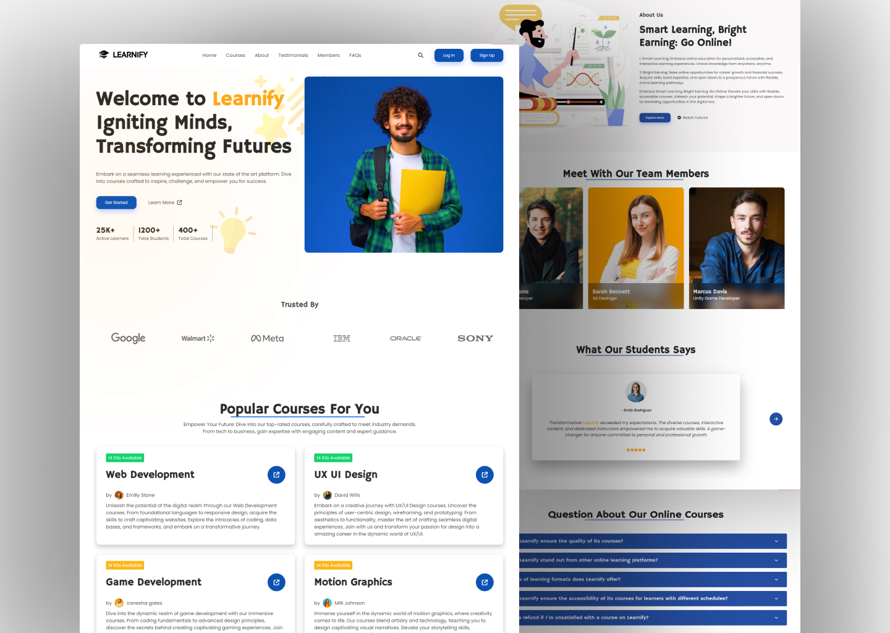

# Learnify Education Website

Welcome to the Learnify Education Website repository! This project is a responsive website dedicated to education, created with HTML, CSS, and JavaScript. It incorporates animations, sliders, and multiple sections for a modern UI design, providing an immersive learning experience.

## Preview



## Features

- **Responsive Design:** Ensures an optimal viewing experience across various devices.
- **Animations:** Engage users with subtle and modern animations throughout the website.
- **Slider:** Showcase featured courses, events, or important information with an interactive slider.
- **Multiple Sections:** Explore different segments like courses, about us, events, and more.
- **Modern UI Design:** Sleek layout for an attractive and user-friendly interface.

## Demo

Check out the live demo of the Learnify Education Website [here](https://devsethi3.github.io/Learnify-Education-Website/#).

## Getting Started

To explore this education website locally, follow these steps:

1. Clone the repository to your local machine:

   ```bash
   git clone https://github.com/Devsethi/Learnify-Education-Website.git
   ```

2. Open the `index.html` file in your preferred web browser.

## Customization

Feel free to customize this website to suit your educational institution or online learning platform. Update content, images, and styles in the HTML, CSS, and JavaScript files.

## Contributing

If you'd like to contribute to this project, please follow these steps:

1. Fork the repository.
2. Create a new branch for your feature or improvement.
3. Make your changes and commit them with descriptive messages.
4. Push your changes to your forked repository.
5. Open a pull request to merge your changes into the main branch.

Explore the Learnify Education Website, provide feedback, and consider contributing to its development. Thank you for checking out the repository!